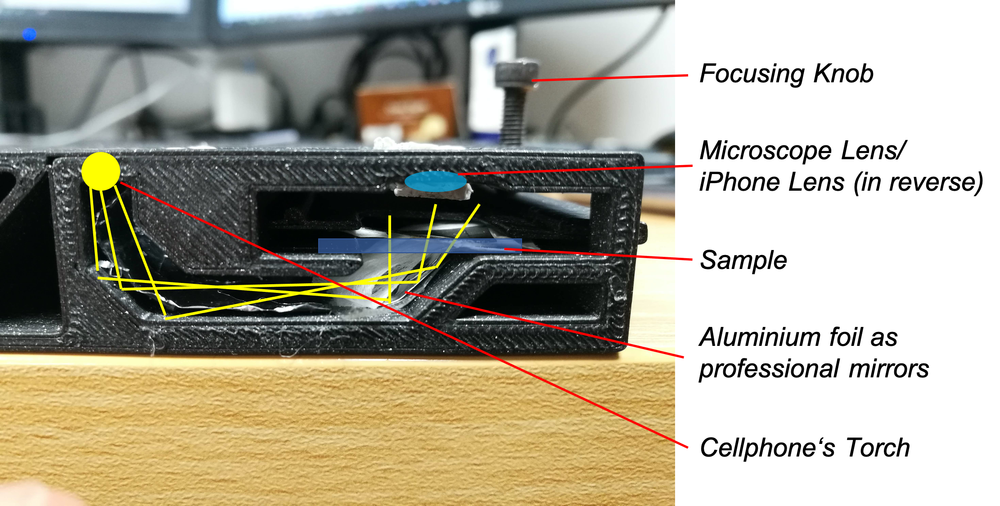

# Monolithic 3D printed Microscope Adapter for Smartphones

This device is supposed to help you adding a microscope to your cellphone. Initially it was designed for the Huawei P20 Pro - therfore the distances between LED and Lens are bound to this hardware design. In theory, every phone works. 
The core idea was to have the phone's torch used as the illumination for the microscope. The imaging path is based on this very nice [publication](https://journals.plos.org/plosone/article?id=10.1371/journal.pone.0095330) and only needs a low-cost lens e.g. from an old cellphone. 

***Features:***

- ~2-3 µm resolution
- Very low cost
- Only one 3D printed part
- refocussing possible by a flexure bearing
- minimum number of additional parts
- ready for polarization microscopy 
- can host an LED for illuminating the sample
- No electronics necessary

***📱Tested Devices*** 

*Huawei P20 Pro:*

- it offes a 3x magnification due to the larger focal length of the inbuild lens!

*Samsung Galaxy S8*

- we added a white light as a light source attached to an old phone charger

Other phones will also work. Eventually one has to adapt the CAD file to match the camera positio. Please file an issue. I'm happy to help! :-)

## 📷 Hands-on VIDEO
A video to see the module in action can be found [here](https://photos.app.goo.gl/RLnbFnBnvYj6ESjV7)

## Software

We rely on the Software "FreedCam" for Android phones. With this we can make use of the tele camera (3x optical zoom) from the Huawei P20.
You can find it in the [Google play store](https://play.google.com/store/apps/details?id=troop.com.freedcam&hl=de&gl=US) or in the github page [here](https://github.com/KillerInk/FreeDcam).

## HARDWARE

All Autodesk Inventor 2019 design files can be found in the folder [CAD/Workspace](./CAD/Workspace). 

### 3D printing files 

|  Type | Details  |  Price | Link  |
|---|---|---|---|
| Smartphone Adapter | Base and stage |  4 € | [STL](./STL/Assembly_SARS_Detector_transmisison_v0_GALAXYS8_01_SARS_detector_transmission_H20P_base_v0.stl)  |

### 📃 Bill of material

This is used in the current version of the setup

|  Type | Details  |  Price | Link  |
|---|---|---|---|
| Objective Lens | iPhone 5s Lens |  4 € | [Ebay](https://www.ebay.com/sch/i.html?_from=R40&_trksid=p2380057.m570.l1313&_nkw=iphone+5+camera+module+&_sacat=0)  |
| 1x M4x20mm Screw  |  off-the-shelf |  .1 € | [e.g. Ebay](https://www.ebay.com/itm/M3-M4-M5-Phillips-Round-Pan-Washer-Head-Machine-Screws-304-A2-Stainless-Steel/153405616897?hash=item23b7aff301:g:ZycAAOSwroJcc1N~)  |
| Aluminium Foil + Paper   |  various |  .1 € | [Amazon]()  |

## 🛠 Assemble the Microscope 🔬

I hope the assembly is more less self explanatory. 

Fix the lens with some "GUM" (blutek/poster fix..) if it wobbles

Add the screw for the focusing mechanism

Add Paper and aluminium foil to guide the light and diffuse it a bit

### Proessional Raytracing

This is how the optical path was meant to be:

## ✉️ Get Involved

This project is open so that anyone can get involved. You don't even have to learn CAD designing or programming. Find ways you can contribute in  [CONTRIBUTING](CONTRIBUTING.md)

## 🔐 License and Collaboration

This project is open-source and is released under the CERN open hardware license. Our aim is to make the kits commercially available.
We encourage everyone who is using our Toolbox to share their results and ideas, so that the Toolbox keeps improving. It should serve as a easy-to-use and easy-to-access general purpose building block solution for the area of STEAM education. All the design files are generally for free, but we would like to hear from you how is it going.

You're free to fork the project and enhance it. If you have any suggestions to improve it or add any additional functions make a pull-request or file an issue.

Please find the type of licenses [here](./License.md)

REMARK: All files have been designed using Autodesk Inventor 2019 (EDUCATION)

## 🦠 Showcase

This is the first manually stitched crystalized sugar on a wellplate ;-)

## Credits
If you find this project useful, please like this repository, follow us on Twitter and cite the webpage! :-)

